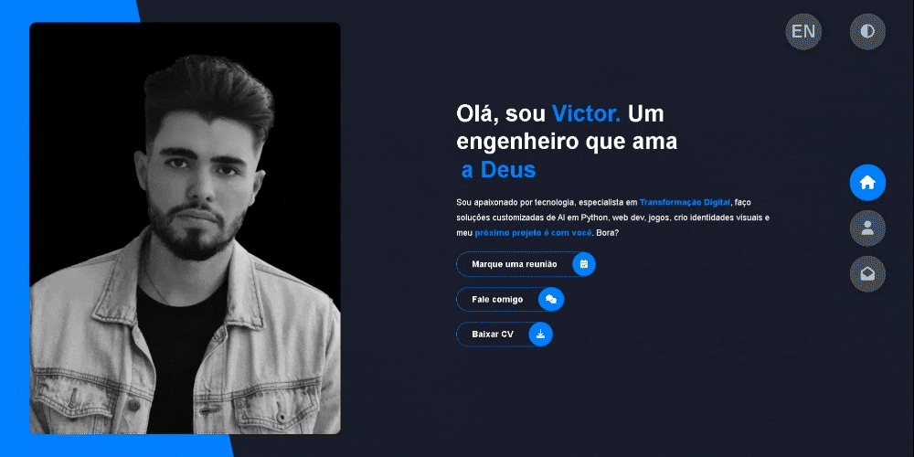

[voaneves.com](https://voaneves.com)
=================

   

    

Portfolio website for Victor Neves. It was based on [this tutorial](https://www.youtube.com/watch?v=xV7S8BhIeBo&t=11521s), but heavily optimized for SEO, lighthouse score ([100/100](https://googlechrome.github.io/lighthouse/viewer/?psiurl=https%3A%2F%2Fvoaneves.com%2F&strategy=mobile&category=performance&category=accessibility&category=best-practices&category=seo&category=pwa&utm_source=lh-chrome-ext)) and accessibility (it's also a PWA). It's an online portfolio to showcase my web presence, CV, timeline for showing skills, profficiency and also to be hired. [Have a look! SITE URL: voaneves.com](https://voaneves.com)

Table of Contents
=================

* [1. Getting Started](#getting_started)
    * [1.1. Technology used](#tech)
    * [1.2. Progressive Web App](#pwa)
    * [1.3. Site optmization](#opt)
    * [1.4. Dark and White themes](#themes)
    * [1.5. English version](#en)             
* [2. Contributing](#contributing)
* [3. License](#license)
* [4. Acknowledgments](#acknowledgments)

## 1. Getting Started

This repository contains the assets required to build [voaneves.com](https://voaneves.com) website and documentation. I'm glad that you are here! Want to contribute? Send me a pull request or an issue.

### 1.1. Technology Used

This website is built using:

HTML | CSS | JavaScript | SASS

### 1.2. Progressive Web App

It's alson a PWA, fully functional to be installable to be used offline. Progressive Web Apps (PWA) are built and enhanced with modern APIs to deliver enhanced capabilities, reliability, and installability while reaching anyone, anywhere, on any device with a single codebase.

### 1.3. Site optmization

This website was fully optimized with SEO in mind, also for the accessibility. Have a look in the lighthouse score ([100/100](https://googlechrome.github.io/lighthouse/viewer/?psiurl=https%3A%2F%2Fvoaneves.com%2F&strategy=mobile&category=performance&category=accessibility&category=best-practices&category=seo&category=pwa&utm_source=lh-chrome-ext)). You can also look to others site auditors and send a PR.

Google Analytics was purposefully removed due to the performance hit.

### 1.4. Dark and white themes

This website features Dark and a White Theme, on PC, tablet or mobile.

    

### 1.5. English version

This website also features a fully translated English version.

    

## 2. Contributing 

Please read [CONTRIBUTING.md](https://gist.github.com/PurpleBooth/b24679402957c63ec426) for details on this repo's code of conduct, and the process for submitting pull requests.

## 3. License 

This project is licensed under the MIT License - see the [LICENSE](LICENSE) file for details.

## 4. Acknowledgments 

* @Maclinz - for his [JS_CSS_PortfolioProject](https://github.com/Maclinz/JS_CSS_PortfolioProject). thanks for the tutorial :D

* [web.dev](https://web.dev) - for the awesome tutorials and guidance when needed.